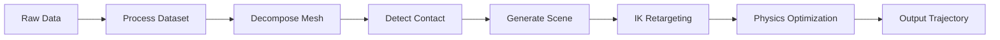

# Workflow: MuJoCo Warp (MJWP)

The MuJoCo Warp (MJWP) workflow is SPIDER's default and most versatile pipeline, supporting both dexterous hand and humanoid robot retargeting with high-performance physics simulation.

## Overview

The MJWP workflow uses MuJoCo with Warp backend for GPU-accelerated physics simulation. It provides the complete pipeline from raw human motion data to physics-based optimized robot trajectories.

**Supported Embodiments:**
- Dexterous hands (Allegro, Inspire, Shadow, Xhand, etc.)
- Humanoid robots (G1, H1, T1, etc.)
- Bimanual configurations


## Workflow Steps



### Step 1: Setup Environment Variables

Define task parameters:

```bash
export TASK=pick_spoon_bowl
export HAND_TYPE=bimanual
export DATA_ID=0
export ROBOT_TYPE=allegro
export DATASET_NAME=oakink
```

### Step 2: Process Dataset

Convert raw human motion data to standardized format:

```bash
uv run spider/process_datasets/oakink.py \
  --task=${TASK} \
  --embodiment-type=${HAND_TYPE} \
  --data-id=${DATA_ID}
```

**What it does:**
- Reads raw motion capture data (MANO poses, object poses)
- Extracts hand kinematics (joint positions, wrist poses)
- Saves processed data in standardized format

**Output:**
```
example_datasets/processed/oakink/mano/bimanual/pick_spoon_bowl/0/
├── trajectory_keypoint.npz
└── info.json
```

::: tip Dataset-Specific Processors
Replace `oakink.py` with the appropriate processor for your dataset:
- `gigahand.py` - GigaHand dataset
- `hot3d.py` - Hot3D dataset
- `fair_fre.py` - FAIR FRE dataset
:::

### Step 3: Decompose Object Mesh

Create convex decomposition for efficient collision detection:

```bash
uv run spider/preprocess/decompose_fast.py \
  --task=${TASK} \
  --dataset-name=${DATASET_NAME} \
  --data-id=${DATA_ID} \
  --embodiment-type=${HAND_TYPE}
```

If you want higher quality convex decomposition, you can use the following command:
```bash
uv run spider/preprocess/decompose.py \
  --task=${TASK} \
  --dataset-name=${DATASET_NAME} \
  --data-id=${DATA_ID} \
  --embodiment-type=${HAND_TYPE}
```

**What it does:**
- Loads object mesh from dataset
- Performs convex decomposition using V-HACD or CoACD
- Saves decomposed mesh components

**Output:**
```
example_datasets/processed/oakink/assets/objects/spoon/convex/
├── 0.obj
├── 1.obj
├── 2.obj
└── visual.obj
```

::: warning
Convex decomposition quality significantly affects simulation accuracy. Complex objects may need manual tuning of decomposition parameters.
:::

### Step 4: Detect Contact (Optional)

Identify hand-object contact points for contact-aware retargeting:

```bash
uv run spider/preprocess/detect_contact.py \
  --task=${TASK} \
  --dataset-name=${DATASET_NAME} \
  --data-id=${DATA_ID} \
  --embodiment-type=${HAND_TYPE}
```

**What it does:**
- Analyzes hand-object proximity throughout trajectory
- Identifies contact points on hand surface
- Saves contact information for trajectory optimization

**Output:**
- Updates `trajectory_keypoint.npz` with contact data

::: tip
Contact detection helps maintain grasp stability during retargeting, especially for manipulation tasks.
:::

### Step 5: Generate Scene

Create MuJoCo scene XML with robot and objects:

```bash
uv run spider/preprocess/generate_xml.py \
  --task=${TASK} \
  --dataset-name=${DATASET_NAME} \
  --data-id=${DATA_ID} \
  --embodiment-type=${HAND_TYPE} \
  --robot-type=${ROBOT_TYPE}
```

**What it does:**
- Loads robot URDF/XML configuration
- Creates scene with objects from dataset
- Sets up collision pairs and contact parameters
- Configures camera and lighting

**Output:**
```
example_datasets/processed/oakink/allegro/bimanual/pick_spoon_bowl/0/
└── scene.xml
```

**Scene structure:**
```xml
<mujoco>
  <compiler angle="radian" meshdir="assets"/>
  <option timestep="0.01"/>

  <!-- Robot -->
  <worldbody>
    <body name="left_hand">...</body>
    <body name="right_hand">...</body>

    <!-- Objects -->
    <body name="spoon">...</body>
    <body name="bowl">...</body>
  </worldbody>

  <!-- Contact pairs -->
  <contact>
    <pair geom1="left_index_tip" geom2="spoon"/>
    ...
  </contact>
</mujoco>
```

### Step 6: Inverse Kinematics (IK)

Convert human hand poses to robot joint angles:

```bash
uv run spider/preprocess/ik.py \
  --task=${TASK} \
  --dataset-name=${DATASET_NAME} \
  --data-id=${DATA_ID} \
  --embodiment-type=${HAND_TYPE} \
  --robot-type=${ROBOT_TYPE} \
  --open-hand
```

**What it does:**
- Loads MANO hand poses
- Solves inverse kinematics for robot joints
- Retargets hand poses to robot configuration
- Initializes with open hand pose (`--open-hand`)

**Output:**
```
example_datasets/processed/oakink/allegro/bimanual/pick_spoon_bowl/0/
└── trajectory_kinematic.npz
```

**Data format:**
```python
# trajectory_kinematic.npz contains:
qpos: [T, nq]  # Joint positions
qvel: [T, nv]  # Joint velocities (zero for kinematic)
ctrl: [T, nu]  # Control targets (same as qpos)
time: [T]      # Timestamps
```

::: tip IK Options
- `--open-hand`: Start IK from open hand pose (recommended)
- `--use-contacts`: Use detected contacts in IK optimization
- `--smooth-qvel`: Add velocity smoothness term
:::

### Step 7: Physics-Based Optimization

Optimize trajectory with physics constraints using DIAL-MPC:

```bash
uv run examples/run_mjwp.py \
  +override=${DATASET_NAME} \
  task=${TASK} \
  data_id=${DATA_ID} \
  robot_type=${ROBOT_TYPE} \
  embodiment_type=${HAND_TYPE}
```

**What it does:**
- Loads kinematic trajectory as reference
- Sets up parallel physics simulation (GPU)
- Runs sampling-based optimization (DIAL-MPC)
- Tracks reference while maintaining physics feasibility

**Real-time visualization** shows:
- Current robot state
- Reference trajectory (transparent)
- Optimization metrics
- Contact forces

**Output:**
```
example_datasets/processed/oakink/allegro/bimanual/pick_spoon_bowl/0/
├── trajectory_mjwp.npz      # Optimized trajectory
├── visualization_mjwp.mp4   # Rendered video
└── metrics.json             # Success metrics
```

## Dataset-Specific Examples

### OakInk Dataset

```bash
export TASK=pick_spoon_bowl
export DATASET_NAME=oakink
export DATA_ID=0

# Full workflow
uv run spider/process_datasets/oakink.py --task=${TASK} --embodiment-type=bimanual --data-id=${DATA_ID}
uv run spider/preprocess/decompose_fast.py --task=${TASK} --dataset-name=${DATASET_NAME} --data-id=${DATA_ID} --embodiment-type=bimanual
uv run spider/preprocess/generate_xml.py --task=${TASK} --dataset-name=${DATASET_NAME} --data-id=${DATA_ID} --embodiment-type=bimanual --robot-type=allegro
uv run spider/preprocess/ik.py --task=${TASK} --dataset-name=${DATASET_NAME} --data-id=${DATA_ID} --embodiment-type=bimanual --robot-type=allegro --open-hand
uv run examples/run_mjwp.py +override=oakink task=${TASK} data_id=${DATA_ID} robot_type=allegro embodiment_type=bimanual
```

### GigaHand Dataset

```bash
export TASK=p36-tea
export DATASET_NAME=gigahand
export DATA_ID=10

# Full workflow
uv run spider/process_datasets/gigahand.py --task=${TASK} --embodiment-type=bimanual --data-id=${DATA_ID}
uv run spider/preprocess/decompose_fast.py --task=${TASK} --dataset-name=${DATASET_NAME} --data-id=${DATA_ID} --embodiment-type=bimanual
uv run spider/preprocess/generate_xml.py --task=${TASK} --dataset-name=${DATASET_NAME} --data-id=${DATA_ID} --embodiment-type=bimanual --robot-type=xhand
uv run spider/preprocess/ik.py --task=${TASK} --dataset-name=${DATASET_NAME} --data-id=${DATA_ID} --embodiment-type=bimanual --robot-type=xhand --open-hand
uv run examples/run_mjwp.py +override=gigahand task=${TASK} data_id=${DATA_ID} robot_type=xhand embodiment_type=bimanual
```

### Hot3D Dataset

```bash
export TASK=P0001_4bf4e21a-obj96945373046044
export DATASET_NAME=hot3d
export DATA_ID=0

# Full workflow
uv run spider/process_datasets/hot3d.py --task=${TASK} --embodiment-type=right --data-id=${DATA_ID}
uv run spider/preprocess/decompose_fast.py --task=${TASK} --dataset-name=${DATASET_NAME} --data-id=${DATA_ID} --embodiment-type=right
uv run spider/preprocess/generate_xml.py --task=${TASK} --dataset-name=${DATASET_NAME} --data-id=${DATA_ID} --embodiment-type=right --robot-type=xhand
uv run spider/preprocess/ik.py --task=${TASK} --dataset-name=${DATASET_NAME} --data-id=${DATA_ID} --embodiment-type=right --robot-type=xhand --open-hand
uv run examples/run_mjwp.py +override=hot3d task=${TASK} data_id=${DATA_ID} robot_type=xhand embodiment_type=right
```
